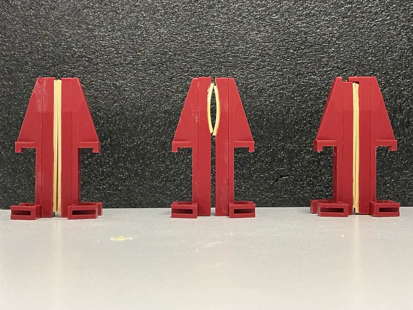
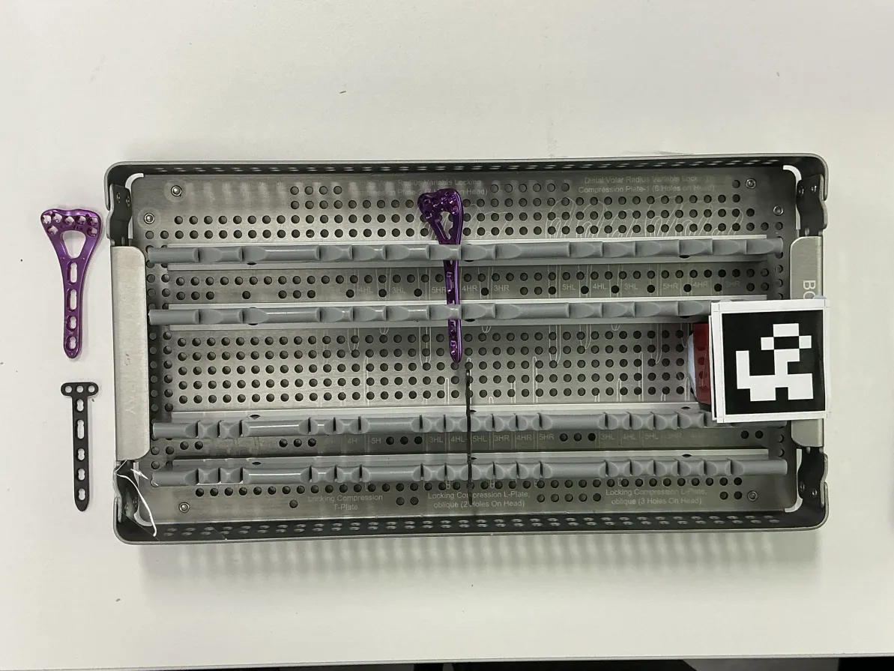

# [end_effector_function_test](https://github.com/adammazechen/end_effector_function_test.git)


This repository contains experiment recordings and result data of three different gripper designs for grasping orthopedic plates.


## Overview

- This project investigates the effectiveness of three sets of gripper designs by their rate of success in performing grasping tasks.

*Figure 1: end effector designs g_0, g_1, g_2 (left to right)*
- Three grasping tasks are performed on two orthopedic plate samples secured in silicon holds in a metal tray. See [Experiment Design](docs/experiment_design.md) for details.

*Figure 2: orthopedic plates and tray used for this experiment*
- This repository contains links to experiment video recordings and result data.
- Consider starting by reading files in [Documents](docs/).
---

## Results and Findings

The performance of 

| ID | Experiment | Pickup Success  | Transport Success | Dropoff Success | Optional Notes |
| -- | -------- | ------ | ----------------- | -------------- | --------|
| g_0  | 0 | 10 | 10 | 10 |         |
| g_0  | 1 | 10 | 10 | 10 |         |
| g_0  | 2 | 10 | 10 | 10 |         |
| g_1  | 0 | 10 | 10 | 10 |         |
| g_1  | 1 | 10 | 10 | 10 |         |
| g_1  | 2 | 10 | 10 | 10 |         |
| g_2  | 0 | 10 | 10 | 10 |         |
| g_2  | 1 | 10 | 10 | 10 |         |
| g_2  | 2 | 10 | 10 | 10 |         |

*Note: Each experiment is run 10 times.*

All three end effector designs displayed high success rate of picking up and transporting the orthopedic plates. See Figure (TODO) for details.
## Repository Structure

```text
end_effector_function_test/
├── README.md
├── docs/
│   ├── methodology.md
│   ├── setup.md
│   └── experiment_design.md
├── src/
├── configs/
├── results/
│   ├── metrics.csv
│   └── plots/
├── assets/
│   ├── images/
│   └── gifs/
└── scripts/
